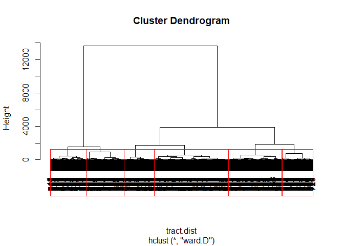
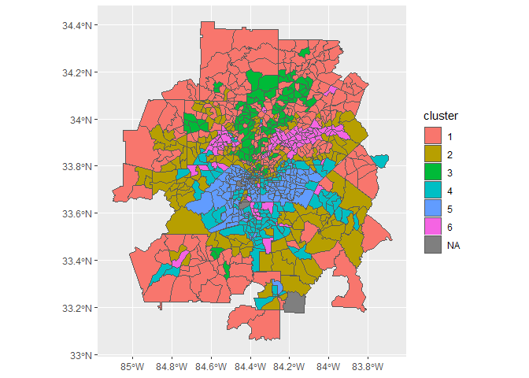

Cluster based analysis of tracts in the Atlanta metro
================

``` r
library(sf)
library(spdep)
library(rgdal)
library(tidyverse)
library(tmap)
```

Read data
---------

First, we read in the data use in our models. This includes the demographic and food environment variables for each year.

``` r
storedist_modeldata<-read_csv("Data/storedist_modeldata_2018_03_10.csv") 
```

| store | year  |    tract\_id|         D1|        D2|        D3|        D4|        D5| st\_name | STTYPE      | sttype2        | gisjn\_tct   |  totpop\_pov|  povpop\_pct|  povpop185\_pct|  hh100k\_pct|  hh150k\_pct|  afam\_pct|   asn\_pct|  hisp\_pct|  under18\_pct|  over64\_pct|  snap\_enroll|  pop1k|     snap1k|  area\_sqkm|   popden1k|  snap\_pct|
|:------|:------|------------:|----------:|---------:|---------:|---------:|---------:|:---------|:------------|:---------------|:-------------|------------:|------------:|---------------:|------------:|------------:|----------:|----------:|----------:|-------------:|------------:|-------------:|------:|----------:|-----------:|----------:|----------:|
| aldi  | Y2008 |  13015960801|   8.868863|  19.00656|  22.56937|  22.92868|  30.69741| Aldi     | Supermarket | Large retailer | G13015960801 |         3130|    11.341853|        20.89457|    17.491166|     3.091873|  12.610340|  0.3783102|   2.522068|      19.79823|     8.890290|      216.4419|  3.130|  0.2164419|    23.81528|  0.1314282|   6.915078|
| aldi  | Y2008 |  13015960802|   9.625737|  20.97837|  23.47469|  24.41901|  31.97999| Aldi     | Supermarket | Large retailer | G13015960802 |         2891|    21.722587|        53.96057|     5.000000|     1.886793|   1.833276|  0.0000000|  12.798340|      18.40194|    16.395711|      217.2537|  2.891|  0.2172537|    18.11431|  0.1595976|   7.514828|
| aldi  | Y2008 |  13015960803|  13.217224|  25.90866|  27.32393|  29.13067|  34.90976| Aldi     | Supermarket | Large retailer | G13015960803 |         5159|    15.313045|        30.54856|    14.712269|     6.188925|   2.615385|  0.0000000|  10.230769|      18.69231|     9.807692|      544.7538|  5.159|  0.5447538|    82.45413|  0.0625681|  10.559291|
| aldi  | Y2008 |  13035150100|  35.064164|  40.36195|  41.77607|  47.24550|  48.58465| Aldi     | Supermarket | Large retailer | G13035150100 |         7557|     8.918883|        24.22919|    11.676973|     1.091306|  19.838689|  0.0000000|   1.535059|      18.09549|    14.296865|     1167.1509|  7.557|  1.1671509|   232.45675|  0.0325093|  15.444632|
| aldi  | Y2008 |  13045910101|  34.133346|  37.05227|  41.70067|  44.71284|  47.56594| Aldi     | Supermarket | Large retailer | G13045910101 |         5972|    22.689216|        44.00536|     4.649123|     1.052632|  31.339554|  3.9986671|   5.231590|      18.59380|    11.696101|      933.7671|  5.972|  0.9337671|    16.56105|  0.3606051|  15.635751|
| aldi  | Y2008 |  13045910103|  38.141789|  41.52183|  46.36072|  48.75723|  50.16716| Aldi     | Supermarket | Large retailer | G13045910103 |         4618|    10.025985|        19.55392|    18.531468|     6.526807|  11.802575|  0.0000000|   7.231760|      14.29185|     9.206009|      557.8731|  4.618|  0.5578731|    56.30526|  0.0820172|  12.080406|

We then create a list of chain names from the model data.

``` r
storelist<-read_csv("Data/atl_stlist_30more_2018_03_03.csv") %>%
  arrange(desc(sttype2)) %>%
  mutate(st_name=factor(st_name,levels=st_name))
```

| store          | st\_name   | STTYPE      | sttype2        |
|:---------------|:-----------|:------------|:---------------|
| kroger         | Kroger     | Super Store | Large retailer |
| target         | Target     | Super Store | Large retailer |
| walmart        | Walmart    | Super Store | Large retailer |
| aldi           | Aldi       | Supermarket | Large retailer |
| food.depot     | Food Depot | Supermarket | Large retailer |
| ingles.markets | Ingles     | Supermarket | Large retailer |

Setting other parameters
------------------------

The code below sets some global parameters for the analysis and plotting.

``` r
#Colors for the three main chain types
cpal<-c("#d7191c", "#d8b365", "#2b83ba")

#Cluster colors
cluster_color<-c("1"="#C8AF8A","2"="#658385","3"="#F6BE41","4"="#A3739E","5"="#B04838","6"="#1f78b4")

#Names of variables
variable_names<-c(
  'afam_pct'="% African-American",
  'asn_pct'="% Asian-American",
  'hisp_pct'="% Hispanic",
  'hh150k_pct'="% hh w/income >$150k",
  'povpop_pct'="% hh in poverty",
  'snap_pct'="% enrolled in SNAP",
  'totpop_pov'="Total population",
  'popden1k'="Pop. density (1,000 per sq. mile)"
)

var_labeller <- function(variable,value){
  return(variable_names[value])
}
```

Collapsing the data across years
--------------------------------

To complete the cluster analysis, we calculate the mean value of the independent model variables across years.

``` r
modeldata_mean <- storedist_modeldata %>%
  gather(totpop_pov:snap_pct,key="var",value="value") %>%
  group_by(tract_id,var) %>%
  summarise(mean=mean(value)) %>%
  spread(var,mean) %>%
  ungroup()
```

|    tract\_id|  afam\_pct|  area\_sqkm|   asn\_pct|  hh100k\_pct|  hh150k\_pct|  hisp\_pct|  over64\_pct|     pop1k|   popden1k|  povpop\_pct|  povpop185\_pct|  snap\_enroll|  snap\_pct|     snap1k|  totpop\_pov|  under18\_pct|
|------------:|----------:|-----------:|----------:|------------:|------------:|----------:|------------:|---------:|----------:|------------:|---------------:|-------------:|----------:|----------:|------------:|-------------:|
|  13015960801|   9.162902|    23.81528|  0.5595386|    18.425956|     3.510161|   3.603252|    10.471385|  3.312167|  0.1390774|    14.403275|        27.80420|      439.0652|   13.12718|  0.4390652|     3312.167|      17.49978|
|  13015960802|   1.972196|    18.11431|  0.2247412|     8.446401|     3.204430|  14.852199|    19.035898|  2.831500|  0.1563129|    27.611595|        53.03388|      441.0144|   15.64651|  0.4410144|     2831.500|      19.45938|
|  13015960803|   3.177091|    82.45413|  0.8959006|    17.068760|     8.527875|   5.861233|    11.886437|  5.417000|  0.0656971|    16.732667|        32.21431|      922.4643|   16.90924|  0.9224643|     5417.000|      16.86602|
|  13035150100|  15.745271|   232.45675|  0.0000000|    12.748946|     2.387039|   1.159559|    14.300742|  7.844000|  0.0337439|    12.978243|        24.34794|     1740.2913|   22.14266|  1.7402913|     7844.000|      16.68186|
|  13045910101|  29.713000|    16.56105|  3.6688904|    11.898753|     1.593001|   3.174116|    13.329608|  5.974833|  0.3607762|    22.188555|        44.08852|     1416.4707|   23.67089|  1.4164707|     5974.833|      20.26625|
|  13045910103|  15.947278|    56.30526|  0.2665629|    16.161473|     5.072001|   8.494441|     9.928832|  4.881333|  0.0866941|     8.853047|        25.37238|      852.3343|   17.38985|  0.8523343|     4881.333|      14.63018|

Creating clusters
-----------------

First, we select just the demographic variables.

``` r
tract.x<-modeldata_mean %>%
  dplyr::select(afam_pct,asn_pct,hisp_pct,hh150k_pct,povpop_pct,snap_pct,popden1k) %>%
  distinct()
```

Then we create a distance matrix between tracts. To allow for clustering, tracts with identical values are set at a distance of 1.

``` r
tract.dist<-dist(tract.x)
tract.dist[tract.dist==0]<-1
```

We use the hclust function to do hierarchical clustering analysis using the calculated distances. Based on our output, we identified six distinct clusters within these data, and these are shown on the output below.

``` r
hc<-hclust(tract.dist, method="ward.D")
plot(hc)
group_num<-6
rect.hclust(hc,k=group_num,border="red")
```



Once identified, we create a list of tracts in each group (hc.groups). These are joined back to the main dataset.

``` r
hc.groups<-data.frame(cutree(hc,k=group_num))
names(hc.groups)<-"cluster"
hc.groups <- hc.groups %>%
  mutate(cluster=as.factor(hc.groups$cluster),
         tract_id=modeldata_mean$tract_id)
tractdata_means_cluster<-left_join(modeldata_mean,hc.groups)
```

    ## Joining, by = "tract_id"

|    tract\_id|  afam\_pct|  area\_sqkm|   asn\_pct|  hh100k\_pct|  hh150k\_pct|  hisp\_pct|  over64\_pct|     pop1k|   popden1k|  povpop\_pct|  povpop185\_pct|  snap\_enroll|  snap\_pct|     snap1k|  totpop\_pov|  under18\_pct| cluster |
|------------:|----------:|-----------:|----------:|------------:|------------:|----------:|------------:|---------:|----------:|------------:|---------------:|-------------:|----------:|----------:|------------:|-------------:|:--------|
|  13015960801|   9.162902|    23.81528|  0.5595386|    18.425956|     3.510161|   3.603252|    10.471385|  3.312167|  0.1390774|    14.403275|        27.80420|      439.0652|   13.12718|  0.4390652|     3312.167|      17.49978| 1       |
|  13015960802|   1.972196|    18.11431|  0.2247412|     8.446401|     3.204430|  14.852199|    19.035898|  2.831500|  0.1563129|    27.611595|        53.03388|      441.0144|   15.64651|  0.4410144|     2831.500|      19.45938| 1       |
|  13015960803|   3.177091|    82.45413|  0.8959006|    17.068760|     8.527875|   5.861233|    11.886437|  5.417000|  0.0656971|    16.732667|        32.21431|      922.4643|   16.90924|  0.9224643|     5417.000|      16.86602| 1       |
|  13035150100|  15.745271|   232.45675|  0.0000000|    12.748946|     2.387039|   1.159559|    14.300742|  7.844000|  0.0337439|    12.978243|        24.34794|     1740.2913|   22.14266|  1.7402913|     7844.000|      16.68186| 1       |
|  13045910101|  29.713000|    16.56105|  3.6688904|    11.898753|     1.593001|   3.174116|    13.329608|  5.974833|  0.3607762|    22.188555|        44.08852|     1416.4707|   23.67089|  1.4164707|     5974.833|      20.26625| 2       |
|  13045910103|  15.947278|    56.30526|  0.2665629|    16.161473|     5.072001|   8.494441|     9.928832|  4.881333|  0.0866941|     8.853047|        25.37238|      852.3343|   17.38985|  0.8523343|     4881.333|      14.63018| 1       |

Mapping the clusters
--------------------

We can map these clusters using a tract shapefile. Further visualization can explore change in variables in the model data file across years, which is shown in our publication.

``` r
tract_map<-st_read("Data/Tract_UA_Atlanta_individual.shp") %>%
  rename("tract_id"=tractid) %>%
  left_join(tractdata_means_cluster) %>%
  distinct()
```

    ## Reading layer `Tract_UA_Atlanta_individual' from data source `C:\Users\jshannon\Dropbox\Jschool\Research\SNAP and SNAP Ed\Data\Stores 2008-2016\retailer_mobility\Data\Tract_UA_Atlanta_individual.shp' using driver `ESRI Shapefile'
    ## Simple feature collection with 870 features and 4 fields
    ## geometry type:  MULTIPOLYGON
    ## dimension:      XY
    ## bbox:           xmin: -85.10679 ymin: 33.05908 xmax: -83.67464 ymax: 34.41259
    ## epsg (SRID):    4326
    ## proj4string:    +proj=longlat +datum=WGS84 +no_defs

    ## Joining, by = "tract_id"

``` r
ggplot(tract_map) + geom_sf(aes(fill=cluster))
```


