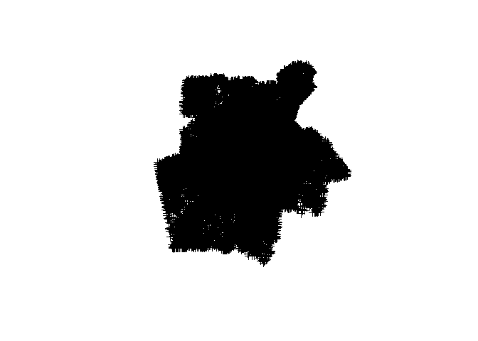

Store distance calculation
================

Load libraries
--------------

First, we load the libraries we'll be using for this analysis.

``` r
library(sf)
library(rgdal)
library(tidyverse)
library(nabor)
library(rgeos)
```

Read in the data
----------------

We use rgdal to load in the block centroids, as it works better for the distance calculations than sf. This shapefile includes block level population from the 2010 U.S. Census.

``` r
blocks<-readOGR("Data","atl_blocks", verbose=FALSE)
blocks<-spTransform(blocks,CRS("+init=epsg:32616 +proj=utm +zone=16 +datum=WGS84 +units=m +no_defs +ellps=WGS84 +towgs84=0,0,0"))
```



We also create a data frame of block IDs through the sf package with the same dataset.

``` r
blocks_sf<-st_read("Data/atl_blocks.shp",quiet=TRUE)
st_geometry(blocks_sf)<-NULL
blocks_id<-blocks_sf %>%
  dplyr::select(GISJOIN, tract_id, Pop2010)
```

|  STATEFP10|  COUNTYFP10|  TRACTCE10|  BLOCKCE10|       GEOID10|    tract\_id| UR10 |  UACE10| UATYP10 | FUNCSTAT10 |       lat|       long| GISJOIN            |  Pop2010|
|----------:|-----------:|----------:|----------:|-------------:|------------:|:-----|-------:|:--------|:-----------|---------:|----------:|:-------------------|--------:|
|         13|          67|      30407|       3008|  1.306703e+14|  13067030407| U    |    3817| U       | S          |  33.93955|  -84.48393| G13006700304073008 |       61|
|         13|          67|      30407|       3021|  1.306703e+14|  13067030407| U    |    3817| U       | S          |  33.93491|  -84.47911| G13006700304073021 |      296|
|         13|          67|      30413|       1019|  1.306703e+14|  13067030413| U    |    3817| U       | S          |  33.91488|  -84.47344| G13006700304131019 |      184|
|         13|          67|      30413|       2008|  1.306703e+14|  13067030413| U    |    3817| U       | S          |  33.92028|  -84.47984| G13006700304132008 |       28|
|         13|          67|      30506|       1011|  1.306703e+14|  13067030506| U    |    3817| U       | S          |  34.00014|  -84.53696| G13006700305061011 |       42|
|         13|          67|      30311|       4021|  1.306703e+14|  13067030311| U    |    3817| U       | S          |  34.05513|  -84.50677| G13006700303114021 |       46|

Since we create a population weighted mean for census tracts, we also need tract geography.

``` r
tracts_ua<-st_read("Data/Tract_UA_Atlanta_individual.shp")[,c(1,2,4)] %>%
  mutate(GISJN_TCT=paste("G",tractid,sep=""))
```

    ## Reading layer `Tract_UA_Atlanta_individual' from data source `C:\Users\jshannon\Dropbox\Jschool\Research\SNAP and SNAP Ed\Data\Stores 2008-2016\retailer_mobility\Data\Tract_UA_Atlanta_individual.shp' using driver `ESRI Shapefile'
    ## Simple feature collection with 870 features and 4 fields
    ## geometry type:  MULTIPOLYGON
    ## dimension:      XY
    ## bbox:           xmin: -85.10679 ymin: 33.05908 xmax: -83.67464 ymax: 34.41259
    ## epsg (SRID):    4326
    ## proj4string:    +proj=longlat +datum=WGS84 +no_defs

``` r
st_geometry(tracts_ua)<-NULL
```

| gisjn\_tct   |  Atl\_Core|      tractid| GISJN\_TCT   |
|:-------------|----------:|------------:|:-------------|
| G13045910103 |          0|  13045910103| G13045910103 |
| G13045910104 |          0|  13045910104| G13045910104 |
| G13045910101 |          0|  13045910101| G13045910101 |
| G13045910200 |          0|  13045910200| G13045910200 |
| G13113140207 |          0|  13113140207| G13113140207 |
| G13113140208 |          0|  13113140208| G13113140208 |

We also need a list of store names. This list was created in a previous script and shows all chains with &gt;20 locations in all years. We use this list to iterate through the stores while calculating distances.

``` r
storelist<-read_csv("Data/atl_stlist_30more_2018_03_03.csv") %>%
  filter(sttype2!="Category")
storelist<-unique(storelist$store)
```

| x                    |
|:---------------------|
| cvs.pharmacy         |
| dollar.general       |
| dollar.tree          |
| family.dollar.store  |
| rite.aid..rite.aid.. |
| walgreen.s.          |

The last dataset has a list of all individual SNAP retailers in Georgia from 2008-2016. The dplyr command chain below reads those data in and adds a tract id created above. It also creates a long format list of only those stores that are present in a given year and on the list of chain retailers we just read in. Lastly, we remove stores from 2014-2016, as those are outside of our study period.

``` r
storedata<-read_csv("Data/GA_SNAPstores_2008_2016_GeoID_dummy.csv") %>%
  right_join(tracts_ua) %>%
  gather(walmart:big.lots,key="store",value="v") %>%
  filter(v==1 & store%in%storelist) %>%
  dplyr::select(-v) %>%
  gather(Y2008:Y2016,key="year",value="present") %>%
  filter(year!="Y2014",year!="Y2015",year!="Y2016",present==1)
```

| STOREID | NAME                     | STREET                     | CITY           | ST  | STTYPE      | STCODE |   ZIP5|  ZIP6|       LONG|       LAT| LOCTYPE |  TRACTID|   PUMAID|  CTYID| GISJN\_CTY | GISJN\_TCT   | GISJN\_PUMA | gisjn\_tct   |  Atl\_Core|      tractid| store   | year  |  present|
|:--------|:-------------------------|:---------------------------|:---------------|:----|:------------|:-------|------:|-----:|----------:|---------:|:--------|--------:|--------:|------:|:-----------|:-------------|:------------|:-------------|----------:|------------:|:--------|:------|--------:|
| R16252  | walmart s/c 2732         | 600 highway 61             | villa rica     | GA  | Super Store | A      |  30180|  4969|  -84.93530|  33.71940| NA      |        0|  1302300|  13045| G1300450   | G13045910101 | G1302300    | G13045910101 |          0|  13045910101| walmart | Y2008 |        1|
| R16261  | walmart s/c 3461         | 2717 highway 54            | peachtree city | GA  | Super Store | A      |  30269|  1031|  -84.59902|  33.39695| NA      |        0|  1302400|  13113| G1301130   | G13113140208 | G1302400    | G13113140208 |          0|  13113140208| walmart | Y2008 |        1|
| R16277  | walmart s/c 594          | 125 pavilion pkwy          | fayetteville   | GA  | Super Store | A      |  30214|  4098|  -84.44222|  33.47962| NA      |        0|  1302400|  13113| G1301130   | G13113140102 | G1302400    | G13113140102 |          0|  13113140102| walmart | Y2008 |        1|
| R16247  | walmart s/c 2475         | 1436 dogwood drive         | conyers        | GA  | Super Store | A      |  30012|     0|  -83.99806|  33.65035| NA      |        0|  1304300|  13247| G1302470   | G13247060305 | G1304300    | G13247060305 |          0|  13247060305| walmart | Y2008 |        1|
| R16322  | walmart supercenter 1766 | 3100 johnson ferry rd      | marietta       | GA  | Super Store | A      |  30062|  5657|  -84.42580|  34.02305| NA      |        0|  1303005|  13067| G1300670   | G13067030328 | G1303005    | G13067030328 |          1|  13067030328| walmart | Y2008 |        1|
| R16312  | walmart supercenter 937  | 2795 chastain meadows pkwy | marietta       | GA  | Super Store | A      |  30066|  3361|  -84.55283|  34.02105| NA      |        0|  1303002|  13067| G1300670   | G13067030228 | G1303002    | G13067030228 |          1|  13067030228| walmart | Y2008 |        1|

Measuring distance
------------------

Since we have to iterate across years and store chains in our analysis, we create two functions. The first uses the gDistance function from the rgeos package to measure the Euclidean distance between block centroids and all store locations provided as a parameter for the function. We join these to the data frame of block IDs we read in above, convert the format from wide to long and select the distances to the five closest locations.

``` r
storeDist<-function(storepoints){
  knn<-data.frame(t((gDistance(blocks,storepoints,byid=TRUE))))
  knn_blockid<-cbind(blocks_id,knn)
  knn_min<-knn_blockid %>%
    gather(-GISJOIN, -tract_id, -Pop2010, key="store",value="dist") %>% 
    dplyr::select(-store) %>%
    group_by(GISJOIN) %>%
    distinct() %>% #get rid of duplicates/ties
    top_n(-5) %>% #Change to adjust number of closest stores 
    arrange(GISJOIN, dist) %>%
    mutate(rank=c("D1","D2","D3","D4","D5")) #Add titles to identify the rank of each distance (1st closest, etc.)
  knn_min
}
```

Our second function applies the distance function to blocks and stores in each chain. We filter the store list to just locations for a given chain, convert those store locations to points in the correct projection, break those points into a list separated by year, then apply our distance function to measure proximity to chain locations in each year. The remaining lines organize and clean up the results.

``` r
storeDist_years<-function(storename){
  store_select<-filter(storedata,store==storename&present==1)
  store_points<-SpatialPointsDataFrame(store_select[,10:11],store_select,
                                       proj4string = CRS("+proj=longlat +datum=WGS84 +ellps=WGS84 +towgs84=0,0,0"))
  store_points1<-spTransform(store_points,CRS("+init=epsg:32616 +proj=utm +zone=16 +datum=WGS84 +units=m +no_defs +ellps=WGS84 +towgs84=0,0,0"))
  store_points_list<-split(store_points1,store_points1$year) #Create a list of points in each year
  store_dist<-lapply(store_points_list,storeDist) #Apply distance function to each year
  storedist_df<-bind_rows(store_dist,.id="year") #Combine list to df and add column for list name/year
  storedist_df$store<-storename
  storedist_df1<-left_join(storedist_df,blocks_id)
  storedist_df1
}
```

We then apply the storeDist\_years function to our list of chain names. This line can take a while (~30 min-1 hour), and the result is a list of distances from block centroids to locations for each chain. In our analysis, we end up with approximately 35 million observations. For memory reasons, the command isn't run here, but you can see an example with just Kroger.

``` r
#storedist<-lapply(storelist,storeDist_years) #The actual command
storelist_short<-"kroger"
storedist<-lapply(storelist_short,storeDist_years)
storedist_df<-bind_rows(storedist) %>%
  mutate(dist=dist/1000)
```

| year  | GISJOIN            |    tract\_id|  Pop2010|      dist| rank | store  |
|:------|:-------------------|------------:|--------:|---------:|:-----|:-------|
| Y2008 | G13001509601011001 |  13015960101|       11|  27.47660| D1   | kroger |
| Y2008 | G13001509601011001 |  13015960101|       11|  27.78801| D2   | kroger |
| Y2008 | G13001509601011001 |  13015960101|       11|  32.72328| D3   | kroger |
| Y2008 | G13001509601011001 |  13015960101|       11|  33.97157| D4   | kroger |
| Y2008 | G13001509601011001 |  13015960101|       11|  35.67675| D5   | kroger |
| Y2008 | G13001509601011003 |  13015960101|        1|  28.61174| D1   | kroger |
| Y2008 | G13001509601011003 |  13015960101|        1|  28.86534| D2   | kroger |
| Y2008 | G13001509601011003 |  13015960101|        1|  33.85855| D3   | kroger |
| Y2008 | G13001509601011003 |  13015960101|        1|  35.08567| D4   | kroger |
| Y2008 | G13001509601011003 |  13015960101|        1|  36.76324| D5   | kroger |
| Y2008 | G13001509601011005 |  13015960101|        8|  28.73521| D1   | kroger |
| Y2008 | G13001509601011005 |  13015960101|        8|  29.15836| D2   | kroger |
| Y2008 | G13001509601011005 |  13015960101|        8|  33.92895| D3   | kroger |
| Y2008 | G13001509601011005 |  13015960101|        8|  35.05442| D4   | kroger |
| Y2008 | G13001509601011005 |  13015960101|        8|  36.66781| D5   | kroger |

Once we have distances calculated for block centroids, we create a population weighted mean distance at tract level. The distwgt variable below is that weighted mean

``` r
storedist_tct<-storedist_df %>%
  mutate(popdist=Pop2010*dist) %>%
  group_by(store,year,rank,tract_id) %>%
  summarize(popsum=sum(Pop2010),
            popdistsum=sum(popdist),
            distwgt=popdistsum/popsum) %>%
  dplyr::select(-popsum,-popdistsum)
```

| store  | year  | rank |    tract\_id|    distwgt|
|:-------|:------|:-----|------------:|----------:|
| kroger | Y2008 | D1   |  13015960101|  29.646470|
| kroger | Y2008 | D1   |  13015960102|  24.692375|
| kroger | Y2008 | D1   |  13015960200|  40.669178|
| kroger | Y2008 | D1   |  13015960300|  30.418739|
| kroger | Y2008 | D1   |  13015960401|  23.943640|
| kroger | Y2008 | D1   |  13015960402|  23.482471|
| kroger | Y2008 | D1   |  13015960500|  21.686104|
| kroger | Y2008 | D1   |  13015960600|  16.662327|
| kroger | Y2008 | D1   |  13015960700|  18.536952|
| kroger | Y2008 | D1   |  13015960801|   7.744334|
| kroger | Y2008 | D1   |  13015960802|   8.329221|
| kroger | Y2008 | D1   |  13015960803|  10.314208|
| kroger | Y2008 | D1   |  13015960901|  17.058861|
| kroger | Y2008 | D1   |  13015960902|  20.337461|
| kroger | Y2008 | D1   |  13015961000|  24.524672|

These distances can be joined with our tract level independent variables for our descriptive anlaysis and statistical models.

``` r
modeldata<-read_csv("Data/storedist_modeldata_2018_03_10.csv") %>%
  dplyr::select(-D1:-D5) %>%
  left_join(storedist_tct)
```
